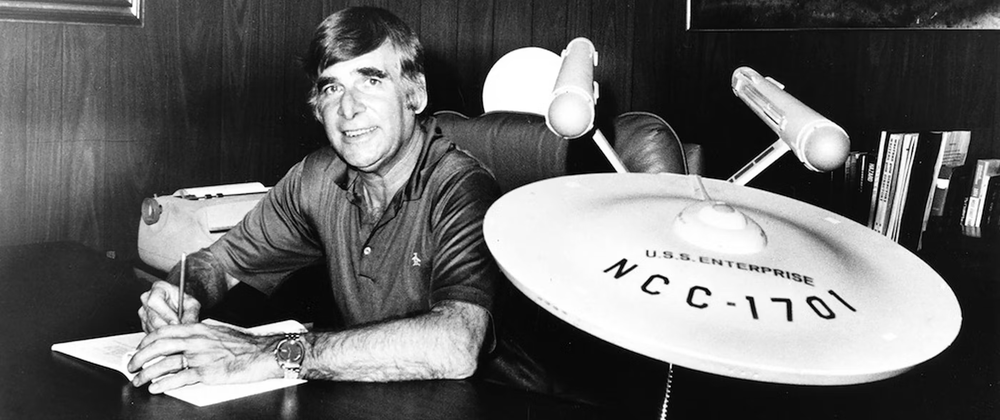

# Captain’s Log - Star Trek Diaries

## Hi There 🖖

I'm [Mesut](https://mesut.me), I’m a Trekkie, inspired by Gene Roddenberry’s wisdom and art. In this sub-blog, I’m trying to share my thoughts on episodes of the Star Trek spinoffs.

I believe each Star Trek instance worth thinking on it. Not all of the episodes are equal, so I’m applying 3-pillar scoring for episodes for ranking them and learning more from them.

Last thing, let's remember what was Star Trek from its original series creator Gene Roddenberry;

> *“Star Trek was an attempt to say that humanity will reach **maturity** and **wisdom** on the day that it begins not just to tolerate, but take a **special delight in differences** in ideas and differences in life forms. If we cannot learn to actually enjoy those small differences, to take a positive delight in those small differences between our own kind, here on this planet, then we do not deserve to go out into space and meet the diversity that is almost certainly out there.”*
> 
> — Gene Roddenberry

Live Long and Prosper🖖

---





*This Blog is also available as:* 


**Open Source**: This blog is an open-sourced blog. Feel free to fork / clone it to build your own Star-Trek themed blog.

---

## My re-watch progress

I watched the whole spinoffs of Star Trek (except some of the modern! replications) and I enjoyed a lot. I decided to re-watch *(and assimilate\*)* Star Trek from scratch and took notes.



*[see: Borg](https://memory-alpha.fandom.com/wiki/Borg)